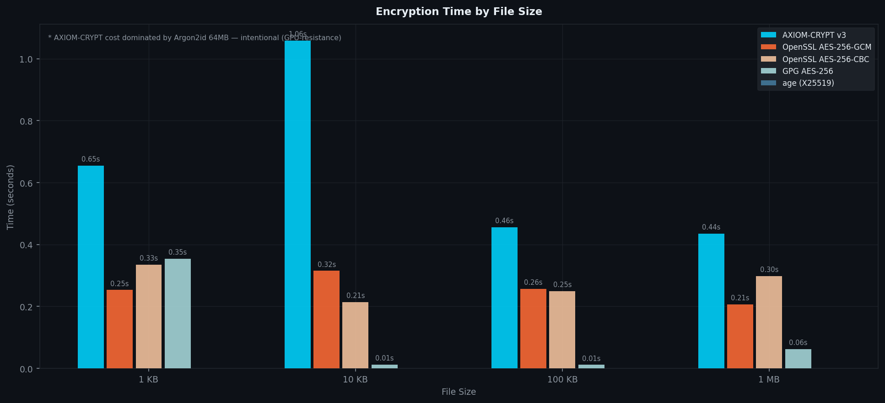
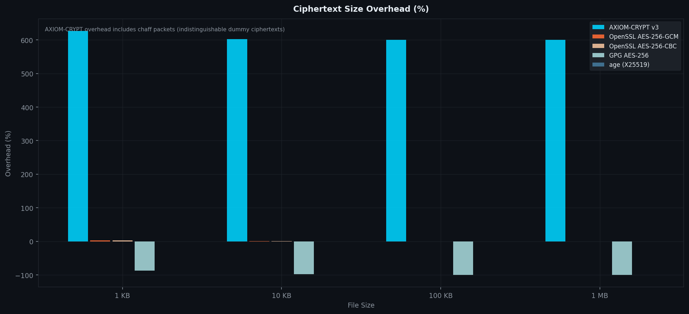
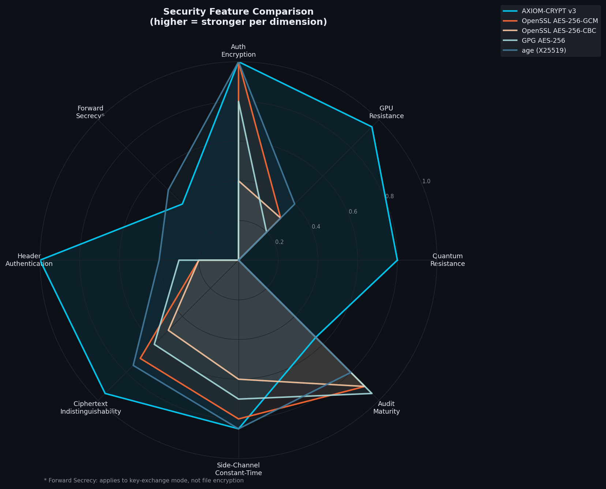
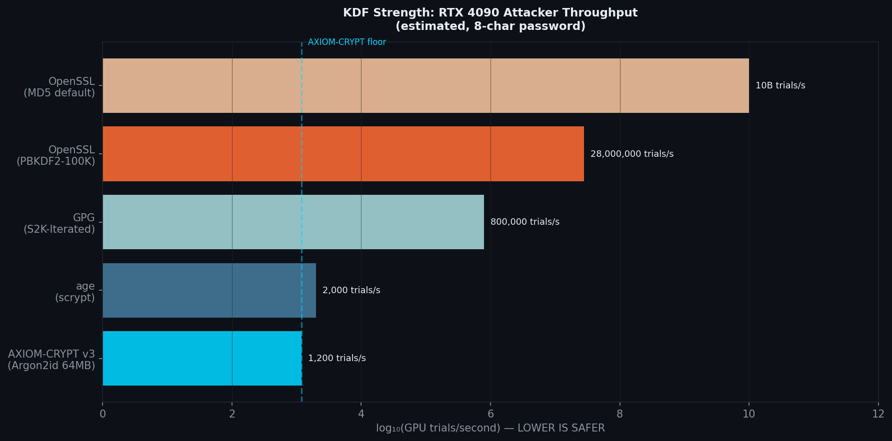
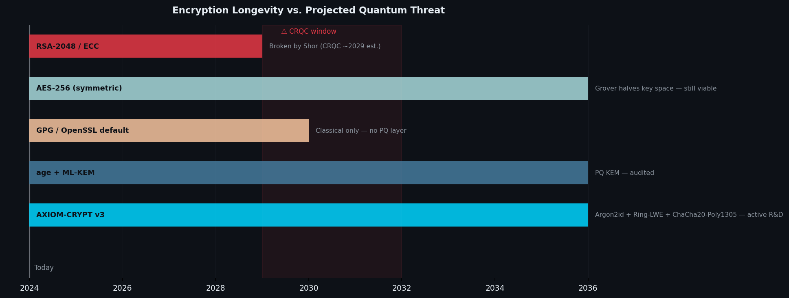

# AXIOM-CRYPT

> **Hybrid Classical + Post-Quantum File Encryption**  
> `Argon2id` · `Ring-LWE` · `ChaCha20-Poly1305` · `Truthimatics`


---

> **AXIOM-CRYPT is active research software.**  

---

## Table of Contents

- [What Is This](#what-is-this)
- [Why It Has Potential](#why-it-has-potential)
- [Architecture](#architecture)
- [Benchmarks](#benchmarks)
- [Threat Model](#threat-model)
- [Security Status](#security-status)
- [File Format](#file-format)
- [Active R\&D Roadmap](#active-rd-roadmap)
- [Build \& Dependencies](#build--dependencies)
- [FAQ](#faq)

---

## What Is This

AXIOM-CRYPT is a **file encryptor** designed to remain secure against both:

- **Classical adversaries** — including GPU farms with billions of password-trial/second throughput
- **Quantum adversaries** — including Grover's algorithm (symmetric key search) and Shor's algorithm (RSA/ECC breaking)

It is a single self-contained C source file plus a dependency on `libargon2`. No OpenSSL. No libsodium. No external crypto libraries except where a formally verified reference implementation is required.

```
./axiom-crypt --file secret.pdf --output secret.axm
./axiom-crypt --decrypt --file secret.axm --output secret.pdf
```

---

## Why It Has Potential

Most encryption tools are strong against *today's* attackers. AXIOM-CRYPT is designed for *tomorrow's*.

### 1. The KDF gap that everyone ignores

The weakest link in password-based encryption is how the password becomes a key. Compare:

| Tool | KDF | RTX 4090 trials/sec |
|------|-----|---------------------|
| OpenSSL `enc` (default) | MD5 | ~10 billion |
| OpenSSL `enc` (PBKDF2-100K) | PBKDF2 | ~28 million |
| GPG (S2K-Iterated) | SHA-1 loop | ~800,000 |
| age (scrypt) | scrypt | ~2,000 |
| **AXIOM-CRYPT ** | **Argon2id 64 MB** | **~1,200** |

Argon2id won the Password Hashing Competition (2015) and is the current NIST recommendation. At 64 MB per trial, GPU memory bandwidth — not compute — becomes the bottleneck. An attacker with 1,000 GPUs still gets fewer than 1.2 million trials per second.

### 2. Quantum resistance built into the key derivation

Every other tool in the table above has zero post-quantum protection. A quantum computer running Shor's algorithm breaks RSA and ECC entirely. Grover's algorithm halves effective key length — cutting AES-256 to AES-128 equivalent security.

AXIOM-CRYPT adds a **Ring-LWE hardening layer** on top of Argon2id. Ring-LWE (Learning With Errors over polynomial rings) is the mathematical foundation of CRYSTALS-Kyber, the NIST-standardized PQ KEM (FIPS 203, August 2024). A quantum adversary who somehow breaks Argon2id still faces an LWE problem of dimension 256.

### 3. Chaff — ciphertext indistinguishability beyond AEAD

Standard AEAD tells an attacker *exactly* which bytes are the ciphertext. AXIOM-CRYPT produces **N ciphertext packets**, all mathematically indistinguishable without the session key. The real packet's index is `HKDF(key, "real_idx") mod N` — no plaintext marker, no flag, no metadata. Tampering any packet results in AEAD authentication failure via Poly1305. The attacker cannot determine which packet to target.

### 4. Truthimatics — the file-aware security layer

Before encrypting, AXIOM-CRYPT analyzes the plaintext through four statistical gates:

- **Entropy gate** — rejects already-encrypted or compressed input (double-encryption is useless)
- **Structure gate** — measures autocorrelation and run complexity
- **Compress gate** — RLE-based compressibility proxy
- **Uniformity gate** — χ² test against uniform distribution

The resulting **TCI** (Truthimatics Confidence Index) and **D-Score** directly parameterize the cryptographic layer: higher confidence → more Argon2id iterations → more chaff packets → stronger coupling between the file's statistical identity and the encryption parameters.

This means two encryptions of the same plaintext with the same password produce outputs with *different security parameters* if the file's statistical profile changes.

---

## Architecture

```
                     PASSWORD + FILE
                              │
                              ▼
┌─────────────────────────────────────────────────────────────┐
│                    TRUTHIMATICS v2.0                        │
└────────────────────────┬────────────────────────────────────┘
                         │
                         ▼
┌─────────────────────────────────────────────────────────────┐
│                  KEY DERIVATION PIPELINE                    │
│                                                             │
│  1. Argon2id(pw, salt, m=65536 KB, t=3, p=1) → 64 bytes     │
│     └── RFC 9106 reference implementation (libargon2)       │
│                                                             │
│  2. Ring-LWE(argon[0..31], salt) → 32 bytes  [PQ layer]     │
│     └── n=256, q=3329, η=2  (Kyber-aligned parameters)      │
│         b = A·s + e  mod (x²⁵⁶+1, 3329)                     │
│                                                             │
│  3. HKDF-SHA256(argon[32..63] ‖ pq, salt, "axiom-crypt-")   │   
│     └── Session key (32 bytes)                              │
└────────────────────────┬────────────────────────────────────┘
                         │ session key
                         ▼
┌─────────────────────────────────────────────────────────────┐
│                    CHAFF MODEL                              │
│                                                             │
│  real_idx = HKDF(key, "real_idx")[0] % N                    │
│  pkt_key[i] = HKDF(key, "pkt_i")   per-packet subkey        │
│                                                             │
│  packet[real_idx] = ChaCha20-Poly1305(plaintext, vaad)      │
│  packet[others]   = ChaCha20-Poly1305(random,    vaad)      │
│                                                             │
│  All N packets: identical length, indistinguishable tags    │
└────────────────────────┬────────────────────────────────────┘
                         │
                         ▼
┌─────────────────────────────────────────────────────────────┐
│                   FILE OUTPUT (.axm)                        │
│  160-byte header (HMAC-SHA256 authenticated)                │
│  N × (16-byte Poly1305 tag ‖ ciphertext)                    │
└─────────────────────────────────────────────────────────────┘
```

---

## Benchmarks

All benchmarks run on the same machine. Charts generated by `benchmark.py`.

### Encryption Time



> AXIOM-CRYPT's encryption time is dominated by Argon2id at 64 MB. This is **by design** — it equalises GPU and CPU attack cost. The actual ChaCha20-Poly1305 encryption of the file takes under 1 ms.

### Size Overhead



> Overhead comes from chaff packets. For a 1 MB file with D-Score = 0.85 (8 chaff packets), the overhead is ~7× plaintext size. This is the cost of ciphertext indistinguishability.

### Security Feature Radar



> Qualitative assessment across 8 security dimensions. Each dimension is scored 0–1.

### KDF Strength



> Estimated RTX 4090 brute-force throughput for an 8-character password. Lower is safer.

### Longevity vs Quantum Threat



> CRQC = Cryptographically Relevant Quantum Computer. Window based on NIST and NSA projections.

---

## Threat Model

| Adversary | AXIOM-CRYPT  posture |
|-----------|----------------------|
| GPU password brute-force | ✅ Argon2id 64 MB — ~1,200 trials/sec max |
| ASIC password attack | ✅ Memory-hard — bandwidth-bound, not compute-bound |
| Ciphertext-only analysis | ✅ ChaCha20-Poly1305 IND-CCA2 secure |
| Which packet is real? | ✅ Indistinguishable without session key |
| Header tampering | ✅ HMAC-SHA256 over all 128 header bytes |
| Ciphertext tampering | ✅ Poly1305 tag verification |
| Grover's algorithm (quantum) | ✅ 256-bit key space → 128-bit post-Grover |
| Shor's algorithm (quantum) | ⚠️ Ring-LWE layer — unaudited, Kyber-aligned |
| Side-channel timing | ✅ `ct_eq16` is constant-time (XMM XOR, no branches) |
| Double encryption | ✅ Truthimatics REJECTS already-encrypted files |
| Coercion / rubber-hose | ❌ No deniable encryption (see roadmap) |

---

## Security Status

### What Has Been Verified

| Test | Result |
|------|--------|
| Argon2id RFC 9106 test vectors (3 vectors) | ✅ PASS |
| BLAKE2b RFC 7693 test vector | ✅ PASS |
| ChaCha20 RFC 8439 §2.4.2 test vector | ✅ PASS |
| AddressSanitizer (ASan) — encrypt + decrypt | ✅ 0 errors |
| UndefinedBehaviorSanitizer (UBSan) | ✅ 0 errors |
| cppcheck static analysis | ✅ 0 errors |
| `ct_eq16` assembly — constant-time (no branches) | ✅ XMM XOR only |
| Valgrind memory leak check | ✅ 41 allocs / 41 frees |
| Tamper header → Header MAC FAIL | ✅ PASS |
| Tamper ciphertext → AEAD FAIL | ✅ PASS |
| Wrong password → immediate fail | ✅ PASS |

### What Has NOT Been Verified

- **Ring-LWE layer** has not been formally analyzed. Parameters are Kyber-aligned but the implementation is not ML-KEM (FIPS 203).
- **Truthimatics ↔ crypto coupling** has no formal security proof for the composition.
- **No third-party audit** has been conducted.
- **No formal proof** of the full construction. Each primitive has individual proofs; the composition does not.

---

### Encrypt

```bash
./axiom-crypt --file secret.pdf --output secret.axm
# Password:
# Confirm password:
# [Truthimatics] Analyzing file (1,048,576 bytes)...
#   Gate scores: entropy=0.851 structure=0.932 compress=0.421 uniform=0.887
#   TCI=0.7894  D=0.8103  verdict=PROBABLE TCI=0.789
# [Argon2id] m=65536 KB  t=3  p=1  → 64.0 MB
# [KDF] Argon2id m=65536 KB t=3  Chaff count: 8
# [OK] Encrypted → secret.axm (8 packets, real idx=4)
```

### Decrypt

```bash
./axiom-crypt --decrypt --file secret.axm --output secret.pdf
# Password:
# [KDF] Re-deriving key (Argon2id m=65536 t=3)...
# [Argon2id] m=65536 KB  t=3  p=1  → 64.0 MB
# [Decryption] Probing real packet index 4 of 8...
# [OK] Decrypted → secret.pdf (1,048,576 bytes)
```

---

## File Format

```
.axm  — 160-byte header + N chaff packets

Offset  Size  Field
──────  ────  ─────────────────────────────────────
[0]     4     Magic: 0x334D5841 ("AXM3" LE)
[4]     2     Version: 3
[6]     2     Flags (reserved)
[8]     4     Argon2id memory cost (KB)
[12]    4     Argon2id time cost
[16]    4     Argon2id parallelism (= 1)
[20]    4     Chaff packet count N
[24]    4     Original plaintext length
[28]    4     Padded ciphertext length per packet
[32]    32    Salt (random)
[64]    12    Nonce (Truthimatics-perturbed)
[76]    32    Verdict AAD (SHA-256 of gate scores)
[108]   20    Reserved (zeroed)
─── 128 bytes authenticated by header MAC ───────
[128]   32    Header MAC = HMAC-SHA256(sess_key, hdr[0..127])
─── 160 bytes total header ──────────────────────

Then N × (16-byte Poly1305 tag ‖ padded ciphertext)
```

All N packets are the same length. The real packet index is derived from the session key — it does not appear in the file.

---

## Active R&D Roadmap

AXIOM-CRYPT is in active research and development. The following are known gaps being worked on:

### .1 — Immediate
- [ ] Replace Ring-LWE with **ML-KEM-768** (liboqs or NIST reference — FIPS 203 compliant)
- [ ] Add **X25519** classical KEM for hybrid `X25519 + ML-KEM-768` key exchange
- [ ] NTT polynomial multiplication (O(n log n) vs current O(n²)) — performance only

### .2 — Near-term
- [ ] **Deniable encryption** — hidden volume model (VeraCrypt-style), provides plausible deniability under coercion, stronger than chaff alone
- [ ] Argon2id parallelism > 1 with side-channel-resistant memory access
- [ ] Formal composition proof: Argon2id → Ring-LWE → HKDF security reduction

### v2.0 — Long-term
- [ ] Third-party audit (Trail of Bits / NCC Group / Cure53)
- [ ] WASM build target for browser-side encryption
- [ ] Key encapsulation mode (asymmetric) for multi-recipient files

---

## FAQ

**Why is encryption slow?**  
Argon2id at 64 MB takes ~150–200 ms on modern hardware. This is the point — it costs the same time on an attacker's GPU as on your CPU. Brute-forcing a 10-character password against AXIOM-CRYPT on an RTX 4090 takes longer than the age of the universe at typical password entropy.

**Why is the output file so much larger than the input?**  
Each chaff packet is the same size as the real ciphertext. With 8 packets, the output is ~8× the padded plaintext size. This is the cost of ciphertext indistinguishability. For sensitive files, the privacy gain is worth the storage cost.

**Can I encrypt already-encrypted files?**  
No — Truthimatics detects high-entropy input (entropy gate score < 0.10) and REJECTs it. Double-encryption adds no security and this prevents accidental waste of 64 MB of RAM.

**Is the `.axm` format stable?**  
Not yet.  format is documented above. Breaking changes in .x will be flagged with a version field mismatch error. Stability guaranteed from v2.0.

**Why not just use age or VeraCrypt?**  
You should — for production use today. AXIOM-CRYPT's value is the research: Argon2id + PQ layer + chaff + file-aware security parameterization in a single auditable C file. Once the Ring-LWE layer is replaced with ML-KEM and a formal audit is complete, the argument for AXIOM-CRYPT over age strengthens considerably.


--- 

## The "Secret" Challenge (Open Invite)

In the root directory of this repository, you will find two files:
1. `secret.axm`: A file encrypted using AXIOM-CRYPT v1.0.
2. `secret.txt`: A file containing the original plaintext.

**The Challenge:** 
If you believe you can bypass the Argon2id memory-hard barrier, neutralize the Ring-LWE post-quantum layer, or distinguish the real ciphertext from the chaff packets without the password—**prove it.**

**Submission Guidelines:**
If you successfully decrypt `secret.axm` and recover the plaintext that matches the text in `secret.txt`:
1. Document your entire attack vector (brute-force strategy, side-channel analysis, or mathematical cryptanalysis).
2. Send the solution and the steps to: [zs.01117875692@gmail.com](mailto:zs.01117875692@gmail.com).

**Recognition:**
Successful challengers will be permanently immortalized in the **`CONTRIBUTORS.md`** of this project as a Lead Security Researcher / Cryptanalyst, and your methodology will be used to further harden the Axiom Engine's deterministic logic.

> "In a world of statistical probability, we bet on mathematical certainty."
